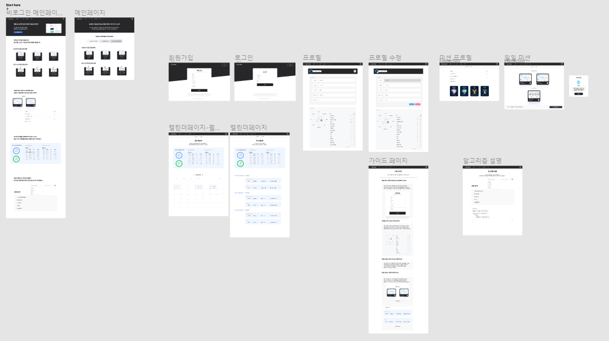
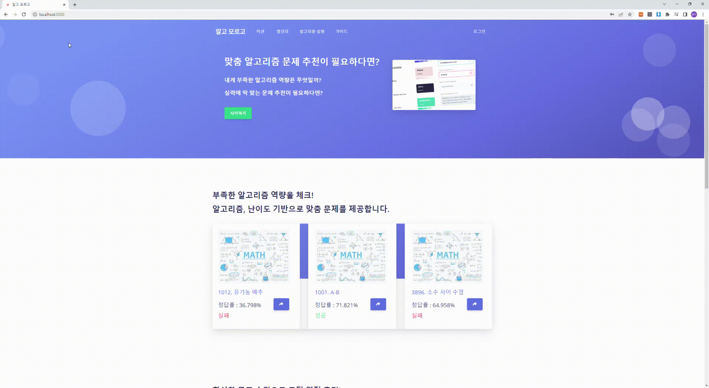
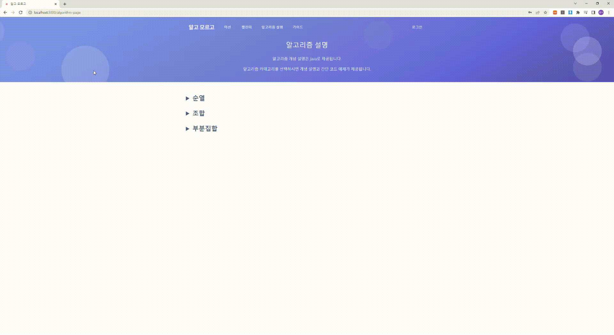
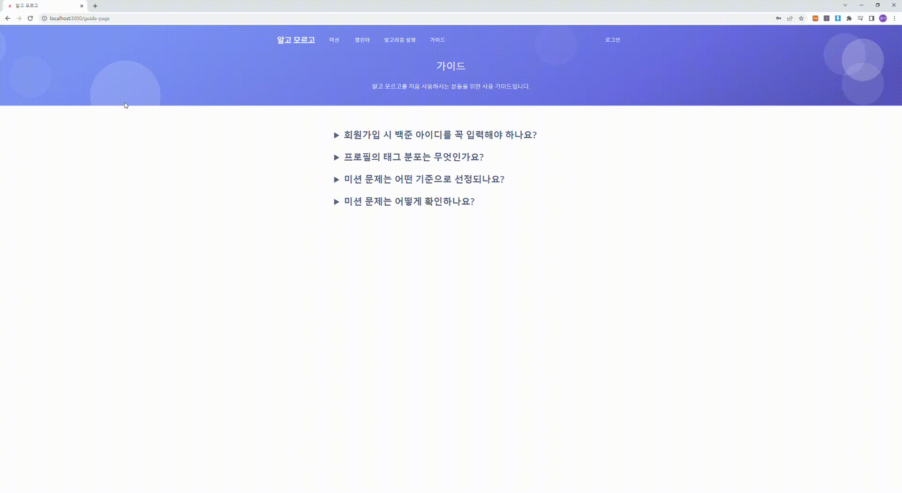

# Frontend

> 프론트엔드 README입니다.

- Node.js 14.17.5로 개발되었습니다.
- node-sass 4.14.1버전을 사용했습니다.

```
npm install
npm uninstall node-sass
npm install node-sass@4.14.1
```


## WireFrame (Figma)

https://www.figma.com/file/BLN03Vt63dAUL5algus7OJ/%EC%95%8C%EA%B3%A0-%EB%AA%A8%EB%A5%B4%EA%B3%A0-team-library?node-id=0%3A1




### Main Page




### Algorithm Page




### Guide Page


